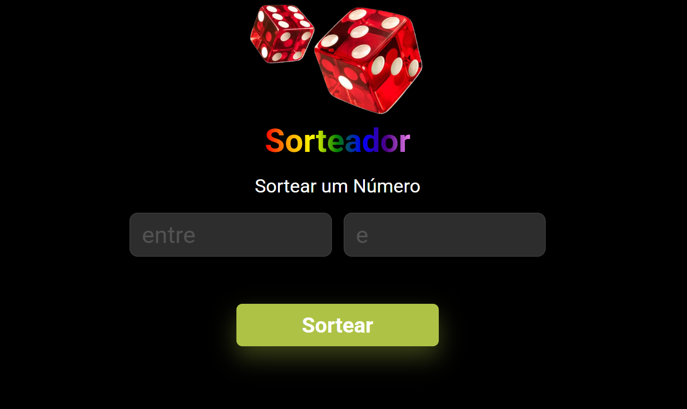

# 🎲 Sorteador Web

Um simples **sorteador de números** feito com **HTML**, **CSS** e **JavaScript**, ideal para sorteios rápidos e visuais em eventos, apresentações ou uso pessoal.

## 📸 Preview

## 🚀 Funcionalidades

- Sorteio de números aleatórios dentro de um intervalo definido pelo usuário
- Interface simples, responsiva e amigável
- Validação de entrada (mínimo e máximo)
- Resultado exibido em destaque

## 🛠️ Tecnologias Utilizadas

- HTML5
- CSS3
- JavaScript

## 🌐 Acesse o Projeto

🔗 [Clique aqui para acessar o sorteador online](https://hugobertoncelo.github.io/Dev-Sorteio/)
